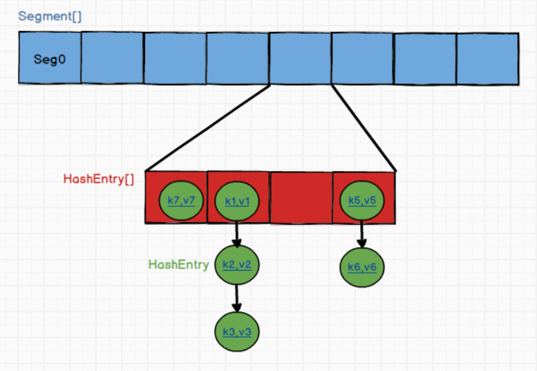
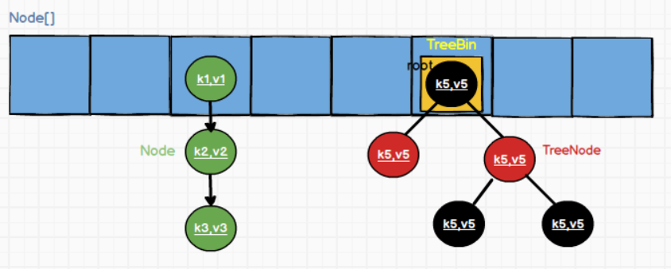

# ConcurrentHashMap源码分析

## 0. JDK1.7 ConcurrentHashMap
  
思想主要是将数据存到一个Segment[]中，而且每个Segment数组均继承自ReentrantLock，
即每个数组中是一个自带一把锁的数据结构，每当需要修改对应位置内容时，可以先对需要修改的Segment加锁，这就是1.7中ConcurrentHashMap支持高并发的分段锁技术。
再来说每个Segment就是一个HashEntry[]，对应每个槽位中是一个个的链表节点（数据结构为HashEntry），即通过链地址法来解决插入时遇到的哈希冲突。


## 1. 关键字段
1. volatile Node<K,V>[] table
1. int sizeCtl
1. LOAD_FACTOR = 0.75f;
1. TREEIFY_THRESHOLD = 8;
1. UNTREEIFY_THRESHOLD = 6;
1. MIN_TREEIFY_CAPACITY = 64;

## 2. 关键(内部)类
1. static class Node<K,V> implements Map.Entry<K,V>{}
1. static final class TreeNode<K,V> extends Node<K,V>{}
1. class TreeBin<K,V> extends Node<K,V>
```java
static final class TreeBin<K,V> extends Node<K,V>{
   TreeNode<K,V> root;
   volatile TreeNode<K,V> first;
   volatile Thread waiter;
   volatile int lockState;
}
```
1. 
```java
static final class ForwardingNode<K,V> extends Node<K,V> {
    final Node<K,V>[] nextTable;
    ForwardingNode(Node<K,V>[] tab) {
        super(MOVED, null, null, null);
        this.nextTable = tab;
    }
}
```

## 3. 构造方法
与JDK1.8 HashMap构造方法类似

## 4. put方法
```java
class ConcurrentHashMap{
    public V put(K key, V value) {
        return putVal(key, value, false);
    }
    
    final V putVal(K key, V value, boolean onlyIfAbsent) {
        if (key == null || value == null) throw new NullPointerException();
        // 为了进一步散列，计算key的hashCode()值再次hash
        int hash = spread(key.hashCode());
        int binCount = 0;
        for (Node<K,V>[] tab = table;;) {
            Node<K,V> f; int n, i, fh;
            // 第一次插入时，table为空，先初始化table
            if (tab == null || (n = tab.length) == 0)
                tab = initTable();
            // i = (n - 1) & hash是插入元素的数组下标
            // f表示该下标对应在数组中的元素
            else if ((f = tabAt(tab, i = (n - 1) & hash)) == null) {
                // f为null时，进行cas操作，对f进行赋值
                // 赋值完成后直接退出循环
                if (casTabAt(tab, i, null,
                             new Node<K,V>(hash, key, value, null)))
                    break;                   // no lock when adding to empty bin
            }
            // fh = f.hash
            // MOVED = -1; forwarding节点的hash值
            // hash for forwarding nodes，表示数组正在扩容
            else if ((fh = f.hash) == MOVED)
                // 协助其他线程扩容
                tab = helpTransfer(tab, f);
            else {
                V oldVal = null;
                // 给f加锁！！
                // 结合尾插法，只会锁住数组里的一个索引位的链表或者红黑树
                synchronized (f) {
                    // 应该是防止加锁过程中对f进行了修改，比如删除
                    if (tabAt(tab, i) == f) {
                        // fh >= 0似乎意味着这是链表节点，不是红黑树节点
                        if (fh >= 0) {
                            binCount = 1;
                            // 遍历链表，并且统计链表节点个数
                            for (Node<K,V> e = f;; ++binCount) {
                                K ek;
                                // 如果找到相同key，覆盖后break
                                if (e.hash == hash &&
                                    ((ek = e.key) == key ||
                                     (ek != null && key.equals(ek)))) {
                                    oldVal = e.val;
                                    if (!onlyIfAbsent)
                                        e.val = value;
                                    break;
                                }
                                Node<K,V> pred = e;
                                // 没有找到key相同的节点
                                // 在链表尾部添加新节点
                                if ((e = e.next) == null) {
                                    pred.next = new Node<K,V>(hash, key, value, null);
                                    break;
                                }
                            }
                        }
                        // 如果f是红黑树节点
                        else if (f instanceof TreeBin) {
                            Node<K,V> p;
                            binCount = 2;
                            // 把f插入红黑树
                            if ((p = ((TreeBin<K,V>)f).putTreeVal(hash, key, value)) != null) {
                                oldVal = p.val;
                                if (!onlyIfAbsent)
                                    p.val = value;
                            }
                        }
                    }
                }
                if (binCount != 0) {
                    // 链表节点的个数（不包括新加的节点）大于等于8
                    if (binCount >= TREEIFY_THRESHOLD)
                        // table长度小于64时选择扩容
                        // 大于64时树化链表
                        treeifyBin(tab, i);
                    if (oldVal != null)
                        return oldVal;
                    break;
                }
            }
        }
        // 线程安全的统计当前的ConcurrentHashMap中所有的元素个数
        addCount(1L, binCount);
        return null;
    }
}

```

## 5. initTable方法
```java
class ConcurrentHashMap{
private final Node<K,V>[] initTable() {
    Node<K,V>[] tab; int sc;
    while ((tab = table) == null || tab.length == 0) {
        // sizeCtl<-1表示当前有其他线程正在初始化数组
        // 因此让出线程执行权，自旋
        if ((sc = sizeCtl) < 0)
            Thread.yield(); // lost initialization race; just spin
            // 加乐观锁，利用cas操作成功修改sizeCtl=-1
            // 表示当前线程正在初始化这个数组，其它线程自旋
        else if (U.compareAndSwapInt(this, SIZECTL, sc, -1)) {
            try {
                // 再次校验
                // 防止该线程在cas加锁过程中，其它线程完成了cas及数组初始化
                if ((tab = table) == null || tab.length == 0) {
                    // n = DEFAULT_CAPACITY = 16
                    int n = (sc > 0) ? sc : DEFAULT_CAPACITY;
                    @SuppressWarnings("unchecked")
                    // 初始化数组
                    Node<K,V>[] nt = (Node<K,V>[])new Node<?,?>[n];
                    table = tab = nt;
                    // 更新sc为扩容阈值
                    sc = n - (n >>> 2);
                }
            } finally {
                // 更新sizeCtl为扩容阈值
                sizeCtl = sc;
            }
            break;
        }
    }
    // 返回初始化之后的数组
    return tab;
}
}
```

## 6. addCount方法
```java
class ConcurrentHashMap{
    private final void addCount(long x, int check) {
        // CounterCell是一个计数的数组
        // 用于辅助统计ConcurrentHashMap中所有元素的个数
        // baseCount+CounterCell中的元素和=ConcurrentHashMap中所有元素的个数
        CounterCell[] as; long b, s;
        if ((as = counterCells) != null ||
            !U.compareAndSwapLong(this, BASECOUNT, b = baseCount, s = b + x)) {
            CounterCell a; long v; int m;
            boolean uncontended = true;
            if (as == null || (m = as.length - 1) < 0 ||
                (a = as[ThreadLocalRandom.getProbe() & m]) == null ||
                !(uncontended =
                  U.compareAndSwapLong(a, CELLVALUE, v = a.value, v + x))) {
                // 这里的CounterCell也有扩容机制
                fullAddCount(x, uncontended);
                return;
            }
            if (check <= 1)
                return;
            s = sumCount();
        }
        // 传入的链表节点个数
        if (check >= 0) {
            Node<K,V>[] tab, nt; int n, sc;
            // s = baseCount + x
            while (s >= (long)(sc = sizeCtl) && (tab = table) != null &&
                   (n = tab.length) < MAXIMUM_CAPACITY) {
                // 返回一个很大的负数
                int rs = resizeStamp(n);
                // sc < 0表示正在扩容
                if (sc < 0) {
                    if ((sc >>> RESIZE_STAMP_SHIFT) != rs || sc == rs + 1 ||
                        sc == rs + MAX_RESIZERS || (nt = nextTable) == null ||
                        transferIndex <= 0)
                        break;
                    if (U.compareAndSwapInt(this, SIZECTL, sc, sc + 1))
                        // 协助扩容
                        transfer(tab, nt);
                }
                else if (U.compareAndSwapInt(this, SIZECTL, sc,
                                             (rs << RESIZE_STAMP_SHIFT) + 2))
                    // 协助扩容
                    transfer(tab, null);
                // baseCount加上counterCells遍历求和
                // 返回的sum相当于HashMap的size
                s = sumCount();
            }
        }
    }
    
    // 累加求和
    // 返回的sum相当于HashMap的size
    final long sumCount() {
        CounterCell[] as = counterCells; CounterCell a;
        long sum = baseCount;
        if (as != null) {
            // baseCount加上counterCells遍历求和
            for (int i = 0; i < as.length; ++i) {
                if ((a = as[i]) != null)
                    sum += a.value;
            }
        }
        return sum;
    }
}

```


## 7. helpTransfer方法
```java
class ConcurrentHashMap{
    final Node<K,V>[] helpTransfer(Node<K,V>[] tab, Node<K,V> f) {
        Node<K,V>[] nextTab; int sc;
        if (tab != null && (f instanceof ForwardingNode) &&
            (nextTab = ((ForwardingNode<K,V>)f).nextTable) != null) {
            int rs = resizeStamp(tab.length);
            while (nextTab == nextTable && table == tab &&
                   (sc = sizeCtl) < 0) {
                if ((sc >>> RESIZE_STAMP_SHIFT) != rs || sc == rs + 1 ||
                    sc == rs + MAX_RESIZERS || transferIndex <= 0)
                    break;
                if (U.compareAndSwapInt(this, SIZECTL, sc, sc + 1)) {
                    // 扩容
                    transfer(tab, nextTab);
                    break;
                }
            }
            return nextTab;
        }
        return table;
    }
}
```

8. transfer方法
```java
class lll{
    private final void transfer(Node<K,V>[] tab, Node<K,V>[] nextTab) {
        int n = tab.length, stride;
        if ((stride = (NCPU > 1) ? (n >>> 3) / NCPU : n) < MIN_TRANSFER_STRIDE)
            stride = MIN_TRANSFER_STRIDE; // subdivide range
        if (nextTab == null) {            // initiating
            try {
                @SuppressWarnings("unchecked")
                Node<K,V>[] nt = (Node<K,V>[])new Node<?,?>[n << 1];
                nextTab = nt;
            } catch (Throwable ex) {      // try to cope with OOME
                sizeCtl = Integer.MAX_VALUE;
                return;
            }
            nextTable = nextTab;
            transferIndex = n;
        }
        int nextn = nextTab.length;
        ForwardingNode<K,V> fwd = new ForwardingNode<K,V>(nextTab);
        boolean advance = true;
        boolean finishing = false; // to ensure sweep before committing nextTab
        for (int i = 0, bound = 0;;) {
            Node<K,V> f; int fh;
            while (advance) {
                int nextIndex, nextBound;
                if (--i >= bound || finishing)
                    advance = false;
                else if ((nextIndex = transferIndex) <= 0) {
                    i = -1;
                    advance = false;
                }
                else if (U.compareAndSwapInt
                         (this, TRANSFERINDEX, nextIndex,
                          nextBound = (nextIndex > stride ?
                                       nextIndex - stride : 0))) {
                    bound = nextBound;
                    i = nextIndex - 1;
                    advance = false;
                }
            }
            if (i < 0 || i >= n || i + n >= nextn) {
                int sc;
                if (finishing) {
                    nextTable = null;
                    table = nextTab;
                    sizeCtl = (n << 1) - (n >>> 1);
                    return;
                }
                if (U.compareAndSwapInt(this, SIZECTL, sc = sizeCtl, sc - 1)) {
                    if ((sc - 2) != resizeStamp(n) << RESIZE_STAMP_SHIFT)
                        return;
                    finishing = advance = true;
                    i = n; // recheck before commit
                }
            }
            else if ((f = tabAt(tab, i)) == null)
                advance = casTabAt(tab, i, null, fwd);
            else if ((fh = f.hash) == MOVED)
                advance = true; // already processed
            else {
                synchronized (f) {
                    if (tabAt(tab, i) == f) {
                        Node<K,V> ln, hn;
                        if (fh >= 0) {
                            int runBit = fh & n;
                            Node<K,V> lastRun = f;
                            for (Node<K,V> p = f.next; p != null; p = p.next) {
                                int b = p.hash & n;
                                if (b != runBit) {
                                    runBit = b;
                                    lastRun = p;
                                }
                            }
                            if (runBit == 0) {
                                ln = lastRun;
                                hn = null;
                            }
                            else {
                                hn = lastRun;
                                ln = null;
                            }
                            for (Node<K,V> p = f; p != lastRun; p = p.next) {
                                int ph = p.hash; K pk = p.key; V pv = p.val;
                                if ((ph & n) == 0)
                                    ln = new Node<K,V>(ph, pk, pv, ln);
                                else
                                    hn = new Node<K,V>(ph, pk, pv, hn);
                            }
                            setTabAt(nextTab, i, ln);
                            setTabAt(nextTab, i + n, hn);
                            setTabAt(tab, i, fwd);
                            advance = true;
                        }
                        else if (f instanceof TreeBin) {
                            TreeBin<K,V> t = (TreeBin<K,V>)f;
                            TreeNode<K,V> lo = null, loTail = null;
                            TreeNode<K,V> hi = null, hiTail = null;
                            int lc = 0, hc = 0;
                            for (Node<K,V> e = t.first; e != null; e = e.next) {
                                int h = e.hash;
                                TreeNode<K,V> p = new TreeNode<K,V>
                                    (h, e.key, e.val, null, null);
                                if ((h & n) == 0) {
                                    if ((p.prev = loTail) == null)
                                        lo = p;
                                    else
                                        loTail.next = p;
                                    loTail = p;
                                    ++lc;
                                }
                                else {
                                    if ((p.prev = hiTail) == null)
                                        hi = p;
                                    else
                                        hiTail.next = p;
                                    hiTail = p;
                                    ++hc;
                                }
                            }
                            ln = (lc <= UNTREEIFY_THRESHOLD) ? untreeify(lo) :
                                (hc != 0) ? new TreeBin<K,V>(lo) : t;
                            hn = (hc <= UNTREEIFY_THRESHOLD) ? untreeify(hi) :
                                (lc != 0) ? new TreeBin<K,V>(hi) : t;
                            setTabAt(nextTab, i, ln);
                            setTabAt(nextTab, i + n, hn);
                            setTabAt(tab, i, fwd);
                            advance = true;
                        }
                    }
                }
            }
        }
    }
}
```

## 8. ConcurrentHashMap并发扩容机制
1. 在调用 addCount 方法增加集合元素计数后发现当前集合元素个数到达扩容阈值时就会触发扩容。
1. 扩容状态下其他线程对集合进行插入、修改、删除、合并、compute 等操作时遇到 ForwardingNode节点会触发扩容。
1. putAll 批量插入或者插入节点后发现存在链表长度达到8个或以上，但数组长度为 64 以下时会触发扩容。
[ConcurrentHashMap1.8 - 扩容详解](https://blog.csdn.net/ZOKEKAI/article/details/90051567)
1. 单个线程扩容范围：\[i,bound]
1. 标志位boolean advance, finishing
1. 一个线程的扩容步长，stride, 默认MIN_TRANSFER_STRIDE = 16