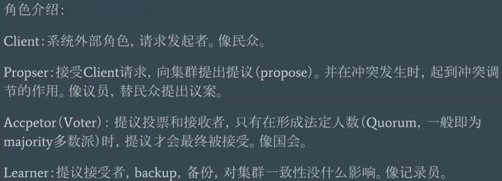
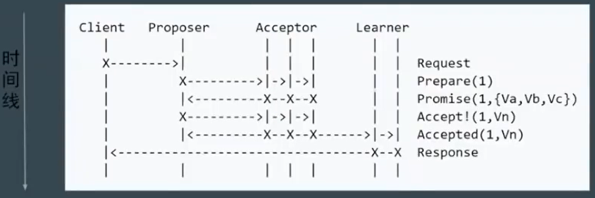

# 分布式一致性原理与实践

## 1. CAP理论
- 一致性（C）：在分布式系统中的所有数据备份，在同一时刻是否同样的值。
- 可用性（A）：在集群中一部分节点故障后，集群整体是否还能响应客户端的读写请求。
- 分区容错性（P）: 分布式系统在遇到任何网络分区故障时，仍要能保证对外提供满足一致性与可用性的服务。
一般必须就当前操作在C和A之间做出选择。

## 2. 强一致性算法
### 2.0 2PC与3PC
### 2.1 Basic Paxos  
===================角色介绍================  
  
===================不同阶段================  
   
===================工作流程================  
  
===================提交失败================  
  
===================活锁的现象================
  
活锁的解决思路：设置随机时长的等待，而不是一次提交失败后立刻重试

- Basic Paxos存在的问题  
难实现，效率低（两轮RPC），活锁
### 2.2 Multi Paxos
===================工作流程================  
  
===================减少角色，简化流程================  
为了进一步简化，提出了新概念：Leader，唯一的Proposer，所有请求都要经过Leader
  

### 2.3 Raft
1. 重定义角色
    - Leader
    - Follower
    - Candidate(原有的Leader离线，Follower被选举称为新Leader前的临时状态)
1. 三个子问题
    - Leader Election
        - 集群起来的时候进行一次选举，选出Leader
        - 所有对于集群的写请求都要进过Leader发起
    - Log Replication
        - Leader接到Client提交的request
        - Leader向所有Follower发送该请求，Follower记录请求log并返回ack
        - Leader接到半数以上Follower的ack后，Leader自己首先commit请求，然后向所有Follower发送commit请求
        - Follower执行commit请求
        - 提交后，收到写请求的那个server向客户端返回成功信息
    - Safety
        - 在Follower心跳超时前没有收到Leader发来的心跳时，对应的Follower成为Candidate，开始尝试提升自己为Leader的选举
            - 多个Candidate时即使用等待随机时长的方式解决
        - 首先自己给自己投票，再发送请求让其他Follower给它投票。
        - 每次新Leader的Term（任期）在之前Leader之上加1
        - 新的Leader产生后及收到一次当前Leader的心跳后，Follower会刷新自己的超时心跳时钟，等待新的Leader心跳
        - 心跳的作用：心跳以及发送的数据

分区恢复后，下边不可用的集群因为自己的Term较小，向上边持续可用的集群更新数据，重新加入集群 
### 2.4 ZAB(Zookeeper Atomic Broadcast)
基本与Raft相同。
在一些名词的叫法上有区别，如Raft称Leader的周期为term，ZAB称为epoch。
实现上也有不同，如Raft保证日志连续性，心跳方向为Leader至Follower，ZAB则相反。

1. 客户端发起一个写操作请求。
1. Leader服务器将客户端的请求转化为事务Proposal提案，同时为每个Proposal分配一个全局的ID，即zxid。
1. Leader服务器为每个Follower服务器分配一个单独的队列，然后将需要广播的Proposal依次放到队列中取，并且根据FIFO策略进行消息发送。
1. Follower接收到Proposal后，会首先将其以事务日志的方式写入本地磁盘中，写入成功后向Leader反馈一个Ack响应消息。
1. Leader接收到超过半数以上Follower的Ack响应消息后，即认为消息发送成功，可以发送commit消息。
1. Leader向所有Follower广播commit消息，同时自身也会完成事务提交。Follower接收到commit消息后，会将上一条事务提交。