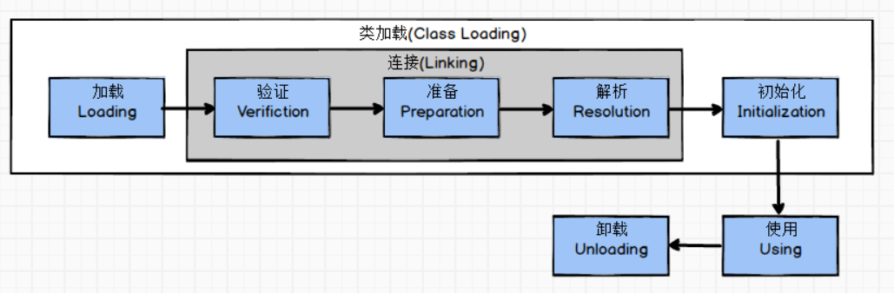

# 第七章 虚拟机类加载机制

## 7.1 概述  
JVM把描述类的数据从Class文件加载到内存，并对数据进行校验、转换解析和初始化，最终形成可以被虚拟机直接使用的Java类型，
这个过程称为虚拟机的**类加载机制**。

## 7.2 类加载的时机
  
关于在什么情况下需要开始类加载的第一个阶段“加载”，《Java虚拟机规范》中并没有强制约束，这点可交由虚拟机的具体实现来自由把握。
但是对于初始化阶段（而加载、验证、准备需要在此之前开始），《Java虚拟机规范》则是严格规定了有且只有六种情况必须对类进行“初始化”。
1. 遇到new、getstatic、putstatic或invokestatic这4条字节码指令时，如果类没有进行过初始化，则需要先触发其初始化。生成这4条指令最常见的java代码场景是：
    - 使用new关键字实例化对象的时候
    - 读取或设置一个类的静态字段（被final修饰、已在编译期把结果放入常量池的静态字段除外）的时候
    - 以及调用一个类的静态方法的时候
1. 使用java.lang.reflect包的方法对类进行反射调用的时候，如果类没有进行过初始化，则需要先触发其初始化。
1. 当初始化一个类的时候，如果发型其父类还没有进行初始化，则需要先触发其父类的初始化。
1. 当虚拟机启动时，用户指定一个要执行的主类（包含main()方法的那个类），虚拟机会先初始化这个主类。
1. 当使用JDK1.7的动态语言支持时，如果一个java.lang.invoke.MethodHandle实例最后的解析结果REF_getStatic、REF_putStatic、REF_invokeStatic的方法句柄，
并且这个方法句柄所对应的类没有进行过初始化，则需要先触发其初始化。
1. 当一个接口中定义了JDK8新加入的默认方法(被default关键字修饰的接口方法)时，若这个接口的实现类发生了初始化，那改接口就要在其之前被初始化。

## 7.3 类加载过程
### 7.3.1 加载
1. 通过一个类的全限定名来获取定义此类的二进制字节流。
1. 将这个字节流所代表的静态存储结构转化为方法区的运行时数据结构。
1. 在内存中生成一个代表这个类的java.lang.Class对象，作为方法区这个类的各种数据的访问入口。
### 7.3.2 验证
验证是连接阶段的第一步，这一阶段的目的是为了确保Class文件的字节流中包含的信息符合当前虚拟机的要求，并且不会危害虚拟机自身的安全。
如果验证失败，会抛出java.lang.VerifyError异常。
1. 文件格式验证  
验证Class文件魔数、主次版本、常量池、类文件本身等等。
1. 元数据验证  
主要是对字节码描述的信息进行语义分析，包括是否有父类、是否是抽象类、是否是接口、是否继承了不允许被继承的类(final类)、是否实现了父类或者接口的方法等等。
1. 字节码验证  
是整个验证过程中最复杂的，主要进行数据流和控制流分析，如保证跳转指令不会跳转到方法体之外的字节码指令、数据类型转换安全有效等。
1. 符号引用验证  
发生在虚拟机将符号引用转化为直接引用的时候(连接第三阶段-解析阶段进行符号引用转换为直接引用)，符号引用验证的目的是确保解析动作能正常执行，如果无法通过符号引用验证，则会抛出java.lang.IncompatibleClassChangeError异常的子类异常，如java.lang.IllegalAccessError、java.lang.NoSuchFieldError、java.lang.NoSuchMethodError等。
### 7.3.3 准备
准备阶段是正式为类变量分配内存并设置类变量初始值的阶段，这些变量所使用的内存都将在方法区中进行分配。
### 7.3.4 解析
解析阶段时虚拟机将常量池内的符号引用替换为直接引用的过程。
### 7.3.5 初始化
在准备阶段，变量已经赋过一次系统要求的初始值，而在初始化阶段，则根据程序员制定的主观计划去初始化类变量和其他资源，或者从另一个角度来表达：初始化阶段是执行类构造器< clinit >()方法的过程。
1. < clinit >方法是由编译器自动收集类中的所有**类变量的赋值动作**和**静态语句块（static{}块）**中的语句合并产生的，编译器收集的顺序是由语句在源文件中出现的顺序所决定的。静态初始化块中只能访问到定义在它之前的类变量，定义在它之后的类变量，在前面的静态初始化中可以赋值，但是不能访问。
1. 由于父类构造器< clinit >方法先于子类构造器执行，因此父类中定义的静态初始化块要先于子类的类变量赋值操作。
1.  类构造器< clinit >方法对于类和接口并不是必须的，如果一个类中没有静态初始化块，也没有类变量赋值操作，则编译器可以不为该类生成类构造器< clinit >方法。
1. 接口中不能使用静态初始化块，但可以有类变量赋值操作，因此接口与类一样都可以生成类构造器< clinit >方法。
接口与类不同的是：
首先，执行接口的类构造器< clinit >方法时不需要先执行父接口的类构造器< clinit >方法，只有当父接口中定义的静态变量被使用时，父接口才会被初始化。
其次，接口的实现类在初始化时同样不会执行接口的类构造器< clinit >方法。
1. java虚拟机会保证一个类的< clinit >方法在多线程环境中被正确地加锁和同步（一个类只被初始化一次），如果多个线程同时去初始化一个类，只会有一个线程去执行这个类的< clinit >方法，其他线程都需要阻塞等待，直到活动线程执行< clinit >方法完毕。
初始化阶段，当执行完类构造器< clinit >方法之后，才会执行实例构造器的< init >方法，实例构造方法同样是按照先父类，后子类，先成员变量，后实例构造方法的顺序执行。

## 7.4 类加载器
### 7.4.1 类与类加载器
对于任意一个类，都必须由加载它的类加载器和这个类本身一起共同确立其在JVM中的唯一性。  
### 7.4.2 双亲委派模式
站在JVM的角度，类加载器有两种：
1. 启动类加载器(Bootstrap Class Loader)
    - 也叫引导类加载器
    - 用C++实现
    - 是虚拟机自身的一部分
    - 加载jre/lib目录下的类
1. 其它类加载器
    - 继承java.lang.ClassLoader，由Java语言实现
    - 独立存在于JVM外部
    1. 扩展类加载器(Extension Class Loader)
        - 在jre/lib/rt.jar!/sun.misc.Launcher$ExtClassLoader中以Java代码实现
        - 加载jre/lib/ext目录下的类
    1. 应用程序类加载器(Application Class Loader)
        - 也叫系统类加载器
        - 在jre/lib/rt.jar!/sun.misc.Launcher$AppClassLoader中以Java代码实现
        - 负责加载用户类路径(ClassPath)上的类库
        - 如果应用程序没有自定义过自己的类加载器，一般AppClassLoader就是程序默认的类加载器
    1. 自定义类加载器  

双亲委派模型的工作过程：  
如果一个类加载器接收到了类加载的请求，它首先不会自己去尝试去加载这个类，而是把这个请求委派给弗雷加载器去完成，每一个层次的类加载都是如此。
因此所有的类加载请求都应该传送到顶层启动类加载器中，只有当父加载器反馈自己无法加载这个请求，子类加载器才会去尝试自己加载。  

双亲委派模式的优势：
1. 采用双亲委派模式的是好处是Java类随着它的类加载器一起具备了一种带有优先级的层次关系，通过这种层级关可以避免类的重复加载，
当父亲已经加载了该类时，就没有必要子ClassLoader再加载一次。
1. 其次是考虑到安全因素，java核心api中定义类型不会被随意替换。
假设通过网络传递一个名为java.lang.Integer的类，通过双亲委托模式传递到启动类加载器，而启动类加载器在核心Java API发现这个名字的类，
发现该类已被加载，并不会重新加载网络传递的过来的java.lang.Integer，而直接返回已加载过的Integer.class，这样便可以防止核心API库被随意篡改。
1. 可能你会想，如果我们在classpath路径下自定义一个名为java.lang.SingleInterge类(该类是胡编的)呢？
该类并不存在java.lang中，经过双亲委托模式，传递到启动类加载器中，由于父类加载器路径下并没有该类，所以不会加载，
将反向委托给子类加载器加载，最终会通过系统类加载器加载该类(即使自定义了类加载器也是一样)。
但是这样做是不允许，因为java.lang是核心API包，需要访问权限，强制加载将会报出如下异常
```java
java.lang.SecurityException: Prohibited package name: java.lang
```

双亲委派模式对于保证Java程序的稳定运作极为重要，但是实现却异常简单。
```java
public abstract class ClassLoader {
    protected Class<?> loadClass(String name, boolean resolve) throws ClassNotFoundException{
        // 线程安全
        synchronized (getClassLoadingLock(name)) {
            // 首先，检查请求加载的类是否已经被加载过了
            Class<?> c = findLoadedClass(name);
            if (c == null) {
                long t0 = System.nanoTime();
                try {
                    if (parent != null) {
                        c = parent.loadClass(name, false);
                    } else {
                        c = findBootstrapClassOrNull(name);
                    }
                } catch (ClassNotFoundException e) {
                    // 如果父类加载器抛出ClassNotFoundException
                    // 说明父类加载器无法完成加载请求
                }

                if (c == null) {
                    // 在父类加载器无法完成加载请求时
                    // 再调用自身的findClass方法来加载请求
                    c = findClass(name);
                }
            }
            if (resolve) {
                resolveClass(c);
            }
            return c;
        }
    }
}
```