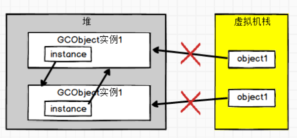

# 第三章 垃圾收集器与内存分配策略

1. 概述
    - 程序计数器、虚拟机栈、本地方法栈等随着线程结束时，内存自然跟着回收，而堆与方法区的内存分配和回收是动态的。

1. 对象已死？
    1. 引用计数法(Reference Counting)  
        
    1. 可达性分析算法(Reachability Analysis)
        - GC Roots
            - 在虚拟机栈、本地方法栈中引用的对象
            - 在方法区中类静态属性引用的对象
            - 在方法区中常量引用的对象，如字符串常量池里的引用
            - JVM内部的引用
            - 所有被同步锁持有的对象
            - 反映JVM内部情况的JMXBean、JVMTI中注册的回调、本地代码缓存等
    1. 再谈引用
        - 强引用>软引用>弱引用>虚引用
        - 只要强引用关系存在，垃圾回收器永远不会收集被引用的对象
    1. 生存还是死亡？
        - 要宣告一个对象的死亡，至少经历两次标记
            1. 可达性分析后发现对象无与GC Roots相连的引用连，被第一次标记
            1. 随后再次筛选该对象是否有必要执行finalize()方法
        - 任何对象的finalize()方法只会被系统自动调用一次
    1. 回收方法区
        - 方法区的垃圾收集“性价比”较堆的垃圾回收要低
        - 方法区的垃圾回收主要是两部分
            1. 废弃的常量
                - 没有任何地方引用该常量
            1. 不再使用的类型
                1. 该类型所有的实例都被回收
                1. 加载该类的类加载器已被回收
                1. 该类队形的java.lang.Class对象没有在任何地方被引用
1. 垃圾收集算法
    - 标记-清除算法(Mark-Sweep)--非移动式
        - 缺点
            - 效率不稳定，随着存活\回收对象数量的变化而变化
            - 内存空间碎片化
        - 关注延迟，如CMS收集器
    - 标记-整理算法(Mark-Compact)--移动式
        - 标记后，存活对象向内存空间一端移动，再清理边界以外的内存
        - 关注吞吐量，如Parallel Scavenger收集器
    - 标记-复制算法(Mark-Copy)
        - 半区复制算法的提出，可用内存仅为50%
        - 优化的半区复制分代策略：80%Eden,10%Survivor1,10%Survivor2,可用内存为90%

1. HotSpot的算法细节实现（TODO）
    1. 根节点枚举
    1. 安全点
    1. 安全区域
    1. 记忆集与卡片
    1. 写屏障
    1. 并发的可达性分析

1. 经典垃圾收集器
    - 新生代收集器(Minor GC)
        - Serial收集器
            - 单线程
            - 在新生代采取**标记-复制**算法进行垃圾回收
            - 暂停所有用户线程
            - 内存消耗最小，是HotSpot虚拟机在客户端模式下的默认**新生代**收集器
        - ParNew收集器
            - 是Serial收集器的多线程版本
        - Parallel Scavenge收集器
            - 多线程
            - 在新生代采取**标记-复制**算法进行垃圾回收
            - 关注点是尽可能缩短垃圾收集时用户线程的停顿时间，也被称为“吞吐量有限收集器”
                - -XX:MaxGCPauseMillis
                - -XX:GCTimeRatio
                - -XX:UseAdaptiveSizePolicy（垃圾收集的自适应调节策略开关）
    - 老年代收集器(Major GC)
        - Serial Old收集器
            - 单线程
            - 在老年代采取**标记-整理**算法进行垃圾回收
            - 暂停所有用户线程
        - Parallel Old收集器
            - 多线程
            - 在老年代采取**标记-整理**算法进行垃圾回收
        - CMS(Concurrent Mark Sweep)收集器
            - 在老年代基于**标记-清除**算法进行垃圾回收
            - 收集过程
                1. 初始标记:**Stop The World**,标记GC Roots可以关联的对象，速度很快
                1. 并发标记:从GC Roots直接关联的对象开始遍历整个图的过程，耗时较长，但是不需停顿用户线程
                1. 重新标记:**Stop The World**, 修正并发标记阶段用户程序继续运行而导致标记产生变动的那部分对象，时间长于初始标记，但远小于并发标记
                1. 并发清除:清理删除掉标记阶段判断死亡的对象
            - 缺点
                - CMS收集器(面向并发)对处理器资源非常敏感
                - 无法处理“浮动垃圾”而导致Concurrent Mode Failure, 从而启动Serial Old收集器，增加停顿时间
                - 标记-清除算法产生大量内存碎片
    - 新生代+老年代收集器组合
        - Serial/Serial Old
        - Serial/CMS/Serial Old
        - ParNew/Serial Old
        - ParNew/CMS/Serial Old
        - Parallel Scavenge/Serial Old
        - Parallel Scavenge/Parallel Old
    - 面向全堆收集器(Mixed GC)
        - Garbage First收集器
            - 特点：在有限的时间内(用户指定)，获得尽可能高的收集效率(Region+优先回收)
                - 使用Region划分内存空间
                - 具有优先级的区域回收
                - 用户可以指定期望的停顿时间
                - 整体看起来基于“标记-整理”，而Region之间又是基于“标记-复制”
            - 收集过程
                1. 初始标记,Stop The World
                1. 并发标记
                1. 最终标记,Stop The World
                1. **筛选回收**,Stop The World  
                更新Region的统计数据，对各个Region的回收价值和成本排序，根据用户期望的停顿时间来制定回收计划，
                可以任意选择多个Region构成回收集，然后把决定回收那部分的Region中存活的对象复制到空Region中，再清理旧的Region全部空间。
            - 与CMS比较
                1. 优点：G1不产生内存空间碎片
                1. 缺点：G1的内存占用和程序运行额外执行负载高于CMS
                1. 选择：小内存(6-8G为界)CMS,大内存G1

1. 低延迟垃圾收集器（TODO）
    - Shenandiah收集器
    - ZGC收集器

1. 选择合适的垃圾收集器（TODO）

1. 实战：内存分配与回收策略
    - 对象优先在Eden分配  
        大多数情况下，对象在新生代Eden区分配。当Eden空间不足时，JVM将发起一起Minor GC。
    - 大对象直接进入老年代
        - 避免大对象的原因  
            1.分配空间时,为了获取足够连续空间安置大对象,易导致有不少空间就提前出发GC  
            2.复制对象时，大对象意味着高额的内存复制开销
        - -XX:PretenureSizeThreshold=<value>  
            超过设定值大小的对象将直接进入老年代
        - 该参数只在Serial和ParNew收集器生效
    - 长期存活的对象将进入老年代  
        1.Eden中的对象经过一次Minor GC后仍然存活，年龄加1。
        2.能被容纳如Survivor的话，会被移动到Survivor
        - -XX:MaxTenuringThreshold=<value>  
            超过该设置值的对象将进入老年代
    - 动态对象年龄判断  
        如果在Survivor空间中相同年龄所有对象的大小总和大于Survivor空间的一半，年龄大于等于该年龄的对象就可以直接进入老年代
    - 空间分配担保  
        通常打开-XX:HandlePromotionFailure，避免频繁的Full GC
        1. 在Minor GC之前，JVM先检查老年代最大可用的连续空间是否大于新生代所有对象总空间
        1. 若满足，则这一次的Minor GC是确保安全的
        1. 若不满足，检查-XX:HandlePromotionFailure参数是否允许担保失败
            1. 允许：检查老年代最大可用的连续空间是否大于历次晋升到老年代对象的平均大小
                1. 若满足，尝试进行Minor GC
                1. 若不满足，进行Full GC
            1. 不允许：进行Full GC
    - [根据GC日志判断使用的GC（垃圾收集器）类型](https://blog.csdn.net/x763795151/article/details/100188865)
    - 设置垃圾回收器种类
        - -XX:+UseSerialGC，虚拟机运行在Client模式下的默认值，Serial+Serial Old。
        - -XX:+UseParNewGC，ParNew+Serial Old，在JDK1.8被废弃，在JDK1.7还可以使用。
        - -XX:+UseConcMarkSweepGC，ParNew+CMS+Serial Old。
        - -XX:+UseParallelGC，虚拟机运行在Server模式下的默认值，Parallel Scavenge+Serial Old(PS Mark Sweep)。
        - -XX:+UseParallelOldGC，Parallel Scavenge+Parallel Old。
        - -XX:+UseG1GC，G1。