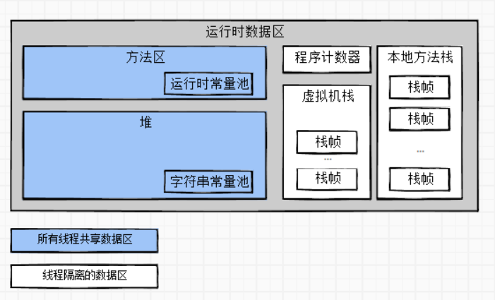

# 第二章 Java内存区域与内存溢出异常

1. 运行时数据区域
    - 程序计数器（Program Counter Register）
        - 一块较小的内存空间，可看做是当前线程所执行的字节码的行号指示器
        - 为了线程切换后能恢复到正确的执行位置，每个线程的程序计数器是独立的，即“线程私有”的
    - Java虚拟机栈（Java Virtual Machine Stack）
        - JVMS描述的是Java方法执行的线程内存模型：每个方法被执行时，JVM都会同步创建一个栈帧(Stack Frame)，
        用于存储局部变量变、操作数栈、动态连接、方法出口等信息。
        - JVMS也是线程私有的，生命周期与线程相同。
        - 局部变量表
            - 存放了编译器可知的各种Java虚拟机基本数据类型、对象引用和returnAddress类型
    - 本地方法栈（Native Method Stack）
        - 类似于JVMS,JVMS是为虚拟机执行Java方法服务，NMS为虚拟机执行Native方法服务
        - HotSopt虚拟机直接将JVMS与NMS合二为一,不加区分
    - Java堆（Java Heap）
        - 是虚拟机所管理的内存中最大的一块，也是线程共享区域
        - 唯一的目的就是存放对象实例
    - 方法区（Method Area）
        - 各个线程共享的内存区域
        - 存储已被虚拟机加载的类型信息、常量、静态变量、即时编译器编译后的代码缓存等数据
        - 运行时常量池（Runtime Constant Pool）  
    
    
1. HotSpot虚拟机对象探秘
    - 对象的创建
    - 对象的内存布局
        1. 对象头(Header)
            - Mark Word，对象自身的运行时数据，如HashCode,GC分代年龄，锁状态标志等
            - 类型指针，即对象指向它的类型元数据的指针，JVM通过这个指针来确定该对象是哪个类的实例
        1. 实例数据(Instance Data)
            - 对象真正存储的有效信息，即代码中定义的各种类型的字段内容
            - 无论自己定义还是父类继承的都必须记录下来
        1. 对其填充(Padding)
            - 并非必然存在，起到占位符的作用
    - 对象的访问定位
        1. 句柄访问：reference(存储句柄地址)->对象句柄->对象实例数据等信息，解耦对象与reference
        1. **直接指针访问**：reference（对象地址）->对象实例数据等信息，速度更快，HotSpot主要采用这种方法

1. 实战：OutOfMemoryError异常
    - Java堆溢出
        - 大量对象导致堆内存溢出
            1. -Xms20m，设置最小堆内存20mb
            1. -Xmx20m，设置最大堆内存20mb
            1. -Xms参数与-Xmx相等时可避免堆自动扩展
        - [内存溢出与内存泄漏](https://www.cnblogs.com/rgever/p/8899758.html)
    - 虚拟机栈和本地方法栈溢出
        - HotSpot虚拟机不支持栈的动态扩展
        - 线程请求栈的深度大于虚拟机允许的最大深度，抛出StackOverFlowError
            1. -Xss参数减小栈内存容量
            1. 定义大量本地变量，增大栈帧中本地变量表的长度
        - 若虚拟机栈内存允许动态拓展，但是扩展栈无法申请到足够内存时，抛出OutOfMemoryError
            1. 创建大量线程，每个线程都要分配独立的虚拟机栈和本地方法栈，导致内存OOM而不是SOF
    - 方法区和运行时常量池溢出
        - JDK6及之前用永久代实现方法区，JDK7逐步“去永久代”，JDK8用元空间实现方法区
        - 创建大量的类填充方法区，导致溢出
            