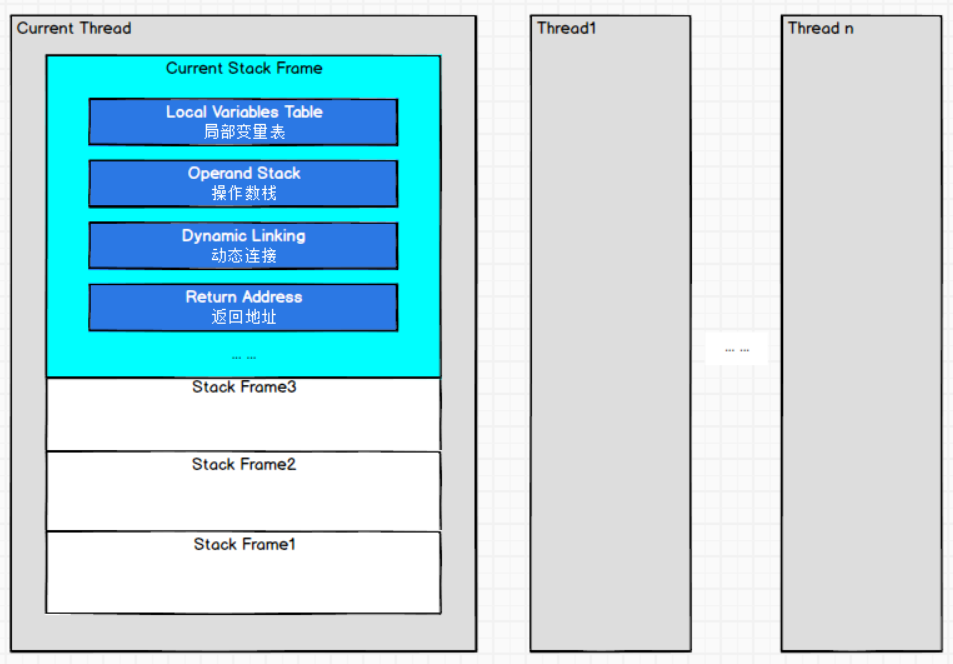

# 第八章 虚拟机字节码执行引擎
JVM中的执行引擎充当了把高级语言翻译成机器语言的译者
从外观上看，所有的JVM输入输出都是一致的：输入时字节码二进制流，处理过程是字节码解析执行的等效过程，输出的是执行结果。

## 8.1 概述
本章的重点是从概念模型的角度讲解虚拟机的方法调用和字节码执行。

## 8.2 运行时栈帧结构
1. JVM以方法作为最基本的执行单元，栈帧是用于支持虚拟机进行方法调用和执行背后的数据结构
1. 在编译期间，栈帧需要多大的局部变量表，需要多深的操作数栈就已经被分析计算出来，并写入方法表的Code属性中
1. 栈帧包括：局部变量表、操作数栈、动态连接、方法返回地址等信息。

### 8.2.1 局部变量表(Local Variables Table)
1. 局部变量表是一组变量值的存储空间，用于存放方法参数和方法内部定义的局部变量。
1. 当一个方法被调用时，JVM会使用局部变量表来完成参数值到参数变量列表的传递过程，即实参到形参的传递。
1. 若执行的是实例方法(未被static修饰)，那么局部变量表的第0位索引的变量槽默认是用于传递方法所属对象实例的引用，在方法中可以通过关键字"this"访问到这个隐含的参数。
### 8.2.2 操作数栈(Operand Stack)
1. 操作数栈也被称为操作栈，是一个先进先出的栈。
1. 当一个方法刚刚开始时，这个方法的操作数栈是空的，在方法的执行过程中，会有字节码指令往操作站中写入和提取内容。
```
 public int test() {
        //int类型
        int a = 5 + 10;      //验证直接相加在编译阶段已合并完结果
        int b = a + 3;        //探究变量与常量的相加过程
        b = b + 6;             //验证int不在-1~5，在-128~127范围的指令是bipush
        b = b + 128;         //验证int不在-128~127，在-32768~32767范围的指令是sipush
        b = b + 32768;     //验证int不在-32768~32767，在-2147483648~2147483647范围的指令是ldc(ldc：从常量池取并压栈，所以这个范围的int是存在常量池)
    }

Code:
      stack=4, locals=13, args_size=1
         0: bipush     15 //1  15压入操作数的栈顶(编译过程中5+10合并成15，并且由于15在-128-127范围，即用bipush)  压栈
         2: istore_1      //2  从栈顶弹出并压入局部变量表访问索引为1的Slot                                                                    弹栈入局部变量表
         3: iload_1       //3  将局部变量表中访问索引为1的Slot重新压入栈顶                                                                    局部变量表入栈
         4: iconst_3      //4  数值3压入操作数的栈顶(范围-1~5，即用指令iconst)                                                              压栈
         5: iadd          //5  将栈顶的前两个弹出并进行加法运算后将结果重新压入栈顶                                                     前两弹栈相加
         6: istore_2      //6   从栈顶弹出并压入局部变量表访问索引为2的Slot                                                                    弹栈入局部变量表
         7: iload_2       //7  将局部变量表中访问索引为2的Slot重新压入栈顶                                                                    局部变量表入栈
         8: bipush      6 //8  6压入操作数的栈顶(在-128-127范围，用bipush指令) 
        10: iadd
        11: istore_2
        12: iload_2
        13: sipush     128//9  128压入操作数的栈顶(在-32768~32767范围，用sipush指令) 
        16: iadd
        17: istore_2
        18: iload_2
        19: ldc           #5  // int 32768  //10  128压入操作数的栈顶(在-2147483648~2147483647范围，用ldc指令) 
        21: iadd
        22: istore_2
```
### 8.2.3 动态连接(Dynamic Linking)
每个栈帧都包含一个指向运行时常量池中该栈帧所属方法的引用，持有这个引用是为了支持方法调用过程中的动态连接(Dynamic Linking)
### 8.2.4 方法返回地址
无论方法采用何种退出方式，在方法退出之后，都必须返回到最初方法被调用时的位置，程序才能继续执行，方法返回时可能需要栈帧中保存一些信息，用来帮助恢复它的上层主调方法的执行状态。方法退出的过程实际上等同于把当前栈帧出栈，因此退出时可能执行的操作：
1. 回复上层方法的局部变量表和操作数栈
1. 把返回值(如果有的话)压入调用者栈帧的操作数栈中
1. 调整PC计数器的值以指向方法调用指令后边的一条指令

## 8.3 方法调用
方法调用并不等于方法中的代码被执行，方法调用阶段的**唯一任务**就是确定被调用方法的版本，暂未涉及方法内部的具体运行过程。
### 8.3.1 解析(Resolution)
所有方法调用的目标方法在Class文件中都是一个常量池中的符号引用，在类加载的解析阶段，会将其中一部分符号引用转化为直接引用，这种解析能够成立的前提是：方法在程序真正运行之前就有一个可确定的调用版本，并且这个方法的调用版本在运行期是不可变的。  
Java语言中符合条件的方法：

1. 静态方法
1. 私有方法
1. 实例构造器
1. 父类方法
1. 被final修饰的方法  
以上这5种方法统称为"非虚方法(Non-Virtual Method)",与之相反，其他方法就称为"虚方法(Virtual Method)"
解析调用是一个静态过程，在**编译期**就完全确定，在类加载阶段就会把设计的符号引用转变为明确的直接引用，不必延迟到**运行期**完成。
### 8.3.2 分派
涉及到方法的重载和重写时，虚拟机如何确定正确的目标方法（需要调用的方法）？
#### 1.静态分派
```
public class StaticDispatch {
    static abstract class Human{}
    static class Man extends Human{}
    static class Woman extends Human{}
    
    public static void sayHello(Human guy){
        System.out.println("hello,guy!");
    }
    
    public static void sayHello(Man guy){
        System.out.println("hello,gentlemen!");
    }
    
    public static void sayHello(Woman guy){
        System.out.println("hello,lady!");
    }

    public static void main(String[] args) {
        Human man=new Man();
        Human woman=new Woman();
        sayHello(man); // 输出hello,guy!
        sayHello(woman); // 输出hello,guy!
    }
}
```
所有依赖静态类型来决定方法执行版本的分派动作，都称为"静态分派",其最典型应用表现就是方法重载。
```
Human human = new Man();
"Human"称为变量的"静态类型(Static Type)"或者"外观类型(Apparent Type)"
"Man"称为变量的"实际类型(Actual Type)"或者"运行时类型(Runtime Type)"

// 静态类型在编译器是可确定的
sr.sayHello((Man) human);
sr.sayHello((Woman) human);

// 实际类型在运行期才能确定
Human human = (new Random()).nextBoolean()?new Man():new Woman();
```
#### 2.动态分派
与Java语言多态性的另一个重要体现--重写有着密切的联系。  
字段不参加多态。

```java
// 定义类
    class Human { 
        public void sayHello(){ 
            System.out.println("Human say hello"); 
        } 
 
    class Man extends Human { 
        @Override 
        protected void sayHello() { 
            System.out.println("man say hello"); 
 
        } 
    } 
 
    class Woman extends Human { 
        @Override 
        protected void sayHello() { 
            System.out.println("woman say hello"); 
 
        } 
    } 

// 测试代码
    public static void main(String[] args) { 

        // 情况1
        Human man = new man(); 
        man.sayHello(); 

        // 情况2
        man = new Woman(); 
        man.sayHello(); 
    } 
}

// 运行结果
//man say hello
//woman say hello

// 原因解析
// 1. 方法重写（Override） = 动态分派 = 根据 变量的动态类型 确定执行（重写）哪个方法
// 2. 对于情况1：根据变量（Man）的动态类型（man）确定调用man中的重写方法sayHello()
// 3. 对于情况2：根据变量（Man）的动态类型（woman）确定调用woman中的重写方法sayHello()

```
#### 3.单分派与多分派
Java语言的静态分派属于多分派，动态分派属于单分派。
#### 4.虚拟机动态分派的实现
在方法区中建立一个虚方法表(Virtual Method Table，一般在类加载的连接阶段初始化)，虚方法表中存放着各个方法的实际入口地址。
1. 如果某个方法在子类中没有被重写，那么子类的虚方法表中的地址入口和父类相同方法的地址入口是一致的，都指向父类的实现入口。
1. 如果子类重写了该方法，子类虚方法表中的地址会指向子类实现版本的入口地址。
## 8.4 动态类型语言支持
### 8.4.1 动态类型语言
### 8.4.2 Java与动态类型
### 8.4.3 java.lang.invoke包
### 8.4.4 invokeDynamic指令
### 8.4.5 实战：掌控方法分派的规则

## 8.5 基于栈的字节码解释执行引擎
### 8.5.1 解释执行
1. 解释执行
    - 将编译好的字节码一行一行地翻译为机器码执行。
    - 优点
        - 当程序需要迅速启动的时候，解释器可以首先发挥作用，省去了编译的时间，立即执行。
        - 解释执行占用更小的内存空间。
        - 同时，当编译器进行的激进优化失败的时候，还可以进行逆优化来恢复到解释执行的状态。
1. 编译执行（后端编译，生成字节码的编译是前端编译）
    - 以方法为单位，将字节码一次性翻译为机器码后执行。
    - 优点：在程序运行时，随着时间的推移，编译器逐渐发挥作用，把越来越多的代码编译成本地代码之后，可以获得更高的执行效率。
### 8.5.2 基于栈的指令集与基于寄存器的指令集
### 8.5.3 基于栈的解释器执行过程
实战
