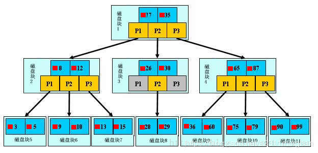
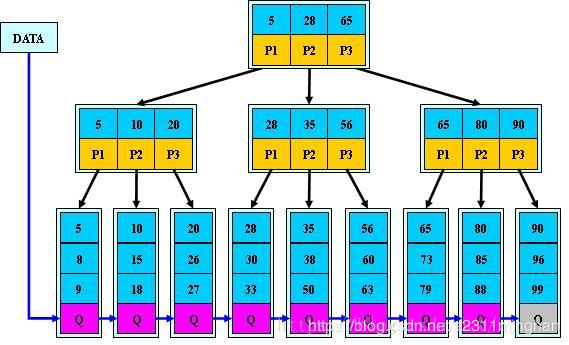
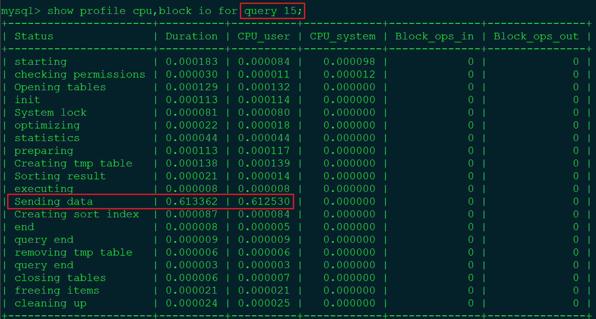

# 高性能MySQL

## 0. mysql之一索引数据结构
1. hash
    1. 检索效率非常高，索引的检索可以一次定位
    1. Hash 索引仅仅能满足"=","IN"和"<=>"查询，不能使用范围查询。
    1. Hash 索引无法被用来数据的排序操作。
    1. Hash 索引不能利用部分索引键查询(即无法建立复合索引)。
    1. Hash 索引在任何时候都不能避免表扫描
    1. 大数据量造成Hash冲突
1. 有序数组
    1. 有序数据可以保证单个值查询时间复杂度在O(log(N)）
    1. 且对范围查询也很友好
    1. 但是有序数组在数据更新的时候，会出现性能问题，即插入速度慢
1. B树  
  
    1. B树的阶：节点的最多子节点个数。比如2-3树的阶是3，2-3-4树的阶是4
    1. B树的搜索，从根结点开始，对结点内的关键字（有序）序列进行二分查找，如果命中则结束，否则进入查询关键字所属范围的儿子结点；
    重复，直到所对应的儿子指针为空，或已经是叶子结点
    1. 关键字集合分布在整颗树中, 即叶子节点和非叶子节点都存放数据.
    1. 搜索有可能在非叶子结点结束
    1. 其搜索性能等价于在关键字全集内做一次二分查找
    1. 更适合文件索引系统（无遍历和范围搜索的需求，平均查找的时间复杂度小于logN）
1. B+树  
  
    1. B+树的搜索与B树也基本相同，区别是B+树只有达到叶子结点才命中（B树可以在非叶子结点命中），其性能也等价于在关键字全集做一次二分查找
    1. 所有关键字都出现在叶子结点的链表中（即数据只能在叶子节点【也叫稠密索引】），且链表中的关键字(数据)恰好是有序的。
    1. 不可能在非叶子结点命中
    1. 非叶子结点相当于是叶子结点的索引（稀疏索引），叶子结点相当于是存储（关键字）数据的数据层
    1. B树和B+树各有自己的应用场景，不能说B+树完全比B树好，反之亦然。
### 0.1. MySQL用B+树(而不是B树)做索引的原因 
1. B+树的磁盘读写代价更低：B+树的内部节点并没有指向关键字具体信息的指针，因此其内部节点相对B树更小，
如果把所有同一内部节点的关键字存放在同一盘块中，那么盘块所能容纳的关键字数量也越多，
一次性读入内存的需要查找的关键字也就越多，降低了树的高度，相对IO读写次数就降低了。
1. B+树更便于遍历：由于B+树的数据都存储在叶子结点中，分支结点均为索引，方便扫库，只需要扫一遍叶子结点即可，
但是B树因为其分支结点同样存储着数据，我们要找到具体的数据，需要进行一次中序遍历按序来扫，
所以B+树更加适合在区间查询的情况，所以通常B+树用于数据库索引。
### 0.2. [聚簇索引](https://www.cnblogs.com/jiawen010/p/11805241.html)
- InnoDB中，表数据文件本身就是按B+Tree组织的一个索引结构，聚簇索引就是按照每张表的主键构造一颗B+树，
- 同时叶子节点中存放的就是整张表的行记录数据，也将聚集索引的叶子节点称为数据页。这个特性决定了索引组织表中数据也是索引的一部分；
- Innodb通过主键聚集数据，如果没有定义主键，innodb会选择非空的唯一索引代替，如果没有这样的索引，innodb会隐式的定义一个主键来作为聚簇索引
- 但是这个如果主键代价较高，故建表时要考虑自增ID不能频繁update这点。
- 我们日常工作中，根据实际情况自行添加的索引都是辅助索引，辅助索引就是一个为了需找主键索引的二级索引，先找到主键索引再通过主键索引找数据。

## 1. SQL执行顺序
1. 手写顺序
```sql
SELECT DISTINCT <select_list> 
FROM <table_list>
<left_table> <join_type>
JOIN <right_table> ON <join_condition>
WHERE <where_condition>
GROUP BY <group_by_list>
HAVING <having_condition>
ORDER BY <order_by_condition>
LIMIT <limit_number>
```
1. 执行顺序
```sql
FROM <left_table> 
ON <join_condition> <join_type> 
JOIN <right_table>
WHERE <where_condition>
GROUP BY <group_by_list>
HAVING <having_condition>
SELECT DISTINCT <select_list> 
ORDER BY <order_by_condition>
LIMIT <limit_number>
```

## 2. 创建索引的时机
### 2.1 适合创建索引的时机
1.主键自动建立唯一索引
2.频繁作为查询的条件的字段应该创建索引
3.查询中与其他表关联的字段，外键关系建立索引
4.频繁更新的字段不适合创建索引（因为每次更新不单单是更新了记录还会更新索引，加重IO负担）
5.Where条件里用不到的字段不创建索引
6.单间/组合索引的选择问题，who？（在高并发下倾向创建组合索引）
7.查询中排序的字段，排序字段若通过索引去访问将大大提高排序的速度
8.查询中统计或者分组字段
### 2.2 不适合创建索引的时机
1.表记录太少
2.经常增删改的表
3.数据重复且分布平均的表字段，因此应该只为经常查询和经常排序的数据列建立索引。 
注意，如果某个数据列包含许多重复的内容，为它建立索引就没有太大的实际效果。
### MySQL索引类型
- 单值索引: 即一个索引只包含单个列，一个表可以有多个单列索引
- 复合索引: 即一个索包含多个列
- 唯一索引: 索引列的值必须唯一，但允许有空值

## 3. Explain(查看执行计划)  
使用EXPLAIN关键字可以模拟优化器执行SQL语句，从而知道MySQL是如何处理你的SQL语句，分析你的查询语句或是结构的性能瓶颈。  

| id   | select_type | table | type | possible_keys | key  | key_len | ref  | rows | filtered | Extra |
| ---- | ----------- | ----- | ---- | ------------- | ---- | ------- | ---- | ---- | -------- | ----- |
1. **表的读取顺序**（id）
    - select查询的序列号，包含一组数字，表示查询中执行select子句或操作表的顺序
    - id相同，执行顺序由上至下
    - id不同，如果是子查询，id的序号会递增，id值越大优先级越高，越先被执行
1. 数据读取操作的操作类型(select_type)
    - SIMPLE:简单的select查询，查询中不包含子查询或者UNION
    - PRIMARY:查询中若包含任何复杂的子部分，最外层查询则被标记为
    - SUBQUERY:在**SELECT**或者**WHERE**列表中包含了子查询
    - DERIVED:在**FROM**列表中包含的子查询被标记为DERIVED（衍生） MySQL会递归执行这些子查询，把结果放在临时表里。
    - UNION:若第二个SELECT出现在UNION之后，则被标记为UNION; 若UNION包含在FROM子句的子查询中，外层SELECT将被标记为：DERIVED
    - UNION RESULT:从UNION表获取结果的SELECT
1. 哪些索引可以使用（possible_keys）
    - 显示可能应用在这张表中的索引,一个或多个。  
      查询涉及的字段上若存在索引，则该索引将被列出，但不一定被查询实际使用。
1. **哪些索引被实际使用**（key）
    - 实际使用的索引。如果为null则没有使用索引
1. 表之间的引用（ref）
    - 显示索引那一列被使用了，如果可能的话，是一个常数。那些列或常量被用于查找索引列上的值
1. **每张表有多少行被优化器查询**（rows）
    - 根据表统计信息及索引选用情况，大致估算出找到所需的记录所需要读取的行数（越少越好）
1. type
    - system:表只有一行记录（等于系统表），这是const类型的特例，平时不会出现，这个也可以忽略不计
    - const:表示通过索引一次就找到了，const用于比较primarykey或者unique索引。因为只匹配一行数据，所以很快。如将主键至于where列表中，MySQL就能将该查询转换为一个常量
    - eq_ref:唯一性索引，对于每个索引键，表中只有**一条记录**与之匹配，常见于主键或唯一索引扫描
    - ref:非唯一索引扫描，**返回匹配某个单独值的所有行**。本质上也是一种索引访问，它返回所有匹配某个单独值的行，然而，它可能会找到多个符合条件的行，所以他应该属于查找和扫描的混合体
    - range:只检索给定范围的行，使用一个索引来选择行。key列显示使用了哪个索引一般就是在你的where语句中出现了between、<、>、in等的查询这种范围扫描索引扫描比全表扫描要好，因为他只需要开始索引的某一点，而结束语另一点，不用扫描全部索引
    - index:FullIndexScan,index与ALL区别为index类型只遍历索引树。这通常比ALL快，因为索引文件通常比数据文件小。（也就是说虽然all和index都是读全表，但index是从索引中读取的，而all是从硬盘中读的）
    - all:FullTableScan, 将遍历全表以找到匹配的行
    - 备注：一般来说，得保证查询只是达到range级别，最好达到ref
1. **extra**（包含不适合在其他列中显示但十分重要的额外信息）
    - Using filesort（九死一生）
      说明mysql会对数据使用一个外部的索引排序，而不是按照表内的索引顺序进行读取。 MySQL中无法利用索引完成排序操作成为“文件排序”
    - Using temporary（十死无生）
      使用了临时表保存中间结果，MySQL在对查询结果排序时使用临时表。常见于排序order by 和分组查询 group by
    - USING index（不错，覆盖索引（Covering Index））
      表示相应的select操作中使用了覆盖索引（Coveing Index）,直接访问索引表(比数据表要小)就可以得到结果，因此避免访问了表的数据行，效率不错！ 
      如果同时出现using where，表明索引被用来执行索引键值的查找； 
      如果没有同时出现using where，表面索引用来读取数据而非执行查找动作。
    
    - Using where
      表面使用了where过滤
    - using join buffer
      使用了连接缓存
    - impossible where
      where子句的值总是false，不能用来获取任何元组
    - select tables optimized away
      在没有GROUPBY子句的情况下，基于索引优化MIN/MAX操作或者 对于MyISAM存储引擎优化COUNT(*)操作，不必等到执行阶段再进行计算， 查询执行计划生成的阶段即完成优化。
    - distinct
      优化distinct，在找到第一匹配的元组后即停止找同样值的工作
      
## 4. 索引优化实战
### 4.1 案例
create index idx_table_abc on table(a,b,c);

|where语句|索引是否被使用|备注|
|--------|-------------|------|
|where a = 3 |用到a||
|where a = 3 and b = 4 |用到a,b||
|where a = 3 and b = 4 and c = 5|用到a,b,c||
|where b = 4 and c = 5 and a = 3 |用到a,b,c|注意mySQL Optimizer对顺序的调整！|
|where b = 4 and c > 5 and a = 3 |用到a,b,c|注意mySQL Optimizer对顺序的调整！|
|where a = 3 and c = 5 and order by b|用到a|b的作用在于排序，而不是查找|
|where a = 3 order by b|用到a|同上|
|where a = 3 order by c|用到a|按照c重新排序，出现Using FileSort！|
|where a = 3 order by b,c|用到a|b,c的作用在于排序，而不是查找|
|where a = 3 order by c,b|用到a|按照c,b重新排序，出现Using FileSort！|
|where a = 3 and b = 4 order by c,b|用到a,b|因为b已经是常数，排序c,b时不用考虑b|
|where a = 3 and b = 4 order by b,c|用到a,b|c的作用在于排序，而不是查找|
|where b > 4 order by a|用到b|a的作用在于排序，而不是查找|
|where order by a ASC b DESC|用到a|b需要重排序，出现Us ing FileSort！|
|where order by a DESC b DESC c DESC|用到a,b,c|同升序或者同降序|
|where order by a d|未使用|d上为创建索引|
|where a in (...) order by b c|未使用|a的范围不确定|
|where a = 3 group by b,c|用到a|b,c的作用在于排序，而不是查找|
|where a = 3 group by c,b|用到a|出现Using FileSort！出现Using temporary！|
|where b = 4 , where b = 5 and c = 5, where c = 5|未使用||
|where a = 3 and c = 5|用到a||
|where a = 3 and b > 4 and c = 5|用到a, b||
|where a = 3 and b like "kk%" and c = 5|用到a,b,c|like KK%相当于=常量|
|where a = 3 and b like "%kk" and c = 5|用到a|%KK和%KK% 相当于范围|
|where a = 3 and b like "%kk%" and c = 5|用到a||
|where a = 3 and b like "k%k%" and c = 5|用到a,b,c||
group by分组前必定排序，因此索引失效规则与order by类似  
group by一般会产生临时表


##########################面试题%like%########################

### 4.2 总结
实际分析的时候，把查询过程结合索引的结构（树）进行思考，可以分析出来结果。  
全值匹配我最爱，**最左前缀**要遵守。  
带头大哥不能死，中间兄弟不能断。  
索引列上少计算，范围之后全失效。  
LIKE百分写左右，覆盖索引不写星。  
不等空值还有OR，索引失效要少用。  
VAR引号不可丢，SQL高级也不难。  

### 4.3 索引创建的意见
- 对于单键索引，尽量选择针对当前query过滤性更好的索引
- 在选择组合索引的时候，当前Query中过滤性最好的字段在索引字段顺序中，位置越靠前越好。
- 在选择组合索引的时候，尽量选择可以能包含当前query中的where子句中更多字段的索引
- 尽可能通过分析统计信息和调整query的写法来达到选择合适索引的目的

## 5. 小表驱动大表
### 5.1 exists的使用
```sql
-- 当B表的数据集必须小于A表的数据集时，用in优于exists
select * from A where id in(select id from B);
-- 当A表的数据集小于B表的数据集时，用exists优于in
select * from A where exists (select 1 from B where A.id=B.id)
```

## 6. 慢日志查询
SQL的慢查询日志是MySQL提供的一种日志记录，它用来记录在MySQL中响应时间超过阀值的语句，
具体指运行时间超过long_query_time值的SQL，则会被记录到慢查询日志中。
如果不是调优需要的话，一般不建议启动该参数，因为开启慢查询日志会或多或少带来一定的性能影响。
```sql
-- 默认关闭，开启
set global slow_query_log = 1;
-- 设置慢日志的阈值，默认10s
set global long_query_time=3;
-- 慢日志查询
SHOW VARIABLES LIKE '%slow_query_log%';
-- 查看慢查询的记录
-- /data/mysql/data/nn1-slow.log
-- 可配合mysqldumpslow命令使用

-- 只对当前会话生效，关闭后失效
-- 要想一直生效，可以配置my.cnf(Linux)或者my.ini(Win)
```

## 7. show profile
是mysql提供可以用来分析当前会话中语句执行的资源消耗情况的命令，用于SQL的调优。
默认情况下处于关闭状态，并保存最近15次的运行结果。
```sql
-- 查看开启情况
SHOW VARIABLES LIKE "profiling";
-- 开启
set profiling=on;
-- 查看结果
show profiles;
show profile cpu,block io for query Query_ID;
```

- 通过show profile发现一般需要注意的状况
    - converting HEAP to MyISAM 查询结果太大，内存都不够用了往磁盘上搬了。
    - Creating tmp table 创建临时表
        - 拷贝数据到临时表
        - 用完再删除
    - Copying to tmp table on disk 把内存中临时表复制到磁盘，危险！！！
    - locked
## 8. 全局查询日志
永远不要在生产环境开启这个功能

## 8. MySQL锁机制
### 8.1 表锁（偏读）
偏向MyISAM存储引擎，开销小，加锁快，无死锁，锁定粒度大，发生锁冲突的概率最高，并发最低。  
MyISAM执行查询语句(select)前，会给所有涉及的表加读锁。在增删改操作前，会给所有涉及的表加写锁
A进程对MyISAM表的读操作（加读锁）：  
- A可以对该表进行读操作，无法对该表进行写操作
- A无法读写其他的表
- 不会阻塞其他进程对同一表的读操作，但会阻塞对该表的写操作。
- 其他线程可以读写其他未加锁的表
- 只有释放该锁以后，才会执行其他进程的写操作。
A进程对MyISAM表的写操作（加写锁）：  
- A可以对该表进行读写操作
- A无法读写其他的表
- 会阻塞其他进程对同一表的读操作和写操作。
- 只有释放该锁以后，才会执行其他进程的读写操作。

### 8.2 行锁（偏写）
偏向InnoDB存储引擎，开销大，加锁慢；会出现死锁；锁定粒度最小，发生锁冲突的概率最低，并发度也最高。
- 自动加锁
    - 对于UPDATE、DELETE和INSERT语句，InnoDB会自动给涉及数据集加排他锁
    - 对于普通SELECT语句，InnoDB不会加任何锁；当然我们也可以显示的加锁
- InnoDB与MyISAM的最大不同有两点
    - 一是支持事务（TRANSACTION）
    - 二是采用了行级锁
- 无索引行锁升级为表锁的危害
    - InnoDB的行锁是针对索引加的锁，不是针对记录加的锁。并且该索引不能失效，否则都会从行锁升级为表锁。
    - varchar不用''，导致系统自动转换类型,索引失效，行锁变表锁
- 间隙锁危害
    - 若执行的条件是范围过大，则InnoDB会将整个范围内所有的索引键值全部锁定，很容易对性能造成影响。
- 如何锁定一行
```sql
-- for update 会锁定当前行
-- 其他行的操作会被阻塞，直到释放锁
select * from table where a = 100 for update;
```
- 优化建议
    - 尽可能让所有数据检索都通过索引来完成，避免无索引行锁升级为表锁
    - 合理设计索引，尽量缩小锁的范围
    - 尽可能较少检索条件，避免间隙锁
    - 尽量控制事务大小，减少锁定资源量和时间长度
    - 尽可能低级别事务隔离

### 8.3 页锁
开销和加锁时间界于表锁和行锁之间：会出现死锁；锁定粒度界于表锁和行锁之间，并发度一般。

## 9. MySQL分区分表分库
### 9.1 分区(变相的水平拆分表，只不过是单库的)
在物理上将这一张表对应的三个文件(.MYD数据文件，.MYI索引文件，.frm表)，分割成许多个小块，在查找一条数据时，
就不用全部查找了，只要知道这条数据在哪一块。
### 9.2 分库
数据库集群环境后都是多台slave,基本满足了读取操作;
但是写入或者说大数据、频繁的写入操作对master性能影响就比较大，
这个时候，单库并不能解决大规模并发写入的问题。
### 9.3 分表
1. 垂直分表  
通常是按照业务功能的使用频次，把主要的、热门的字段放在一起做为主要表；
然后把不常用的，按照各自的业务属性进行聚集，拆分到不同的次要表中；
主要表和次要表的关系一般都是一对一的。
1. 水平拆分  
mysql单表的容量不超过500W，否则建议水平拆分
### 9.4 分库分表的演变过程
单库多表--->读写分离主从复制--->垂直分库，每个库又可以带着salve--->继续垂直分库，极端情况单库单表
--->分区(变相的水平拆分表，只不过是单库的)--->水平分表后再放入多个数据库里，进行分布式部署

## 10. 主从复制
### 10.1 复制的基本原理
1. master将改变记录到二进制日志（binary log）。这些记录过程叫做二进制日志事件，binary log events；
1. slave将master的binary log events拷贝到它的中继日志（relay log）；
1. slave重做中继日志中的事件，将改变应用到自己的数据库中。 MySQL复制是异步的且串行化的
### 10.2 基本原则
1. 每个slave只有一个master
1. 每个slave只能有一个唯一的服务器ID
1. 每个master可以有多个salve

## 10. trouble shooting
1. 至少先跑一天，观察生产的慢SQL情况
1. 开启慢查询日志，设置阈值(比如5s)，超过的就是慢SQL，将其抓出来
1. explain+慢SQL分析
1. show profile查看sql语句在服务器中的执行细节与生命周期
1. 运维或者DBA对数据库服务器参数调优


## 11. 语法
```sql
-- IF(expr1,expr2,expr3)
select *,if(age=1,"男","女") as ages from user;

SELECT 
    (CASE 
        WHEN age=1 THEN '男'
        WHEN age=2 THEN '女' 
        ELSE '未知' 
    END)
as ages
```

