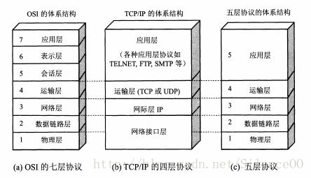
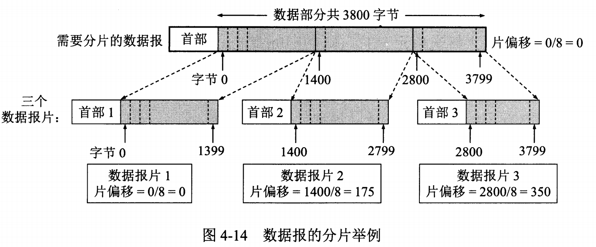

# 重点

## 1. 概述  

### 1.1 五层协议
1. 应用层 ：为**特定应用程序**提供数据传输服务，例如 HTTP、DNS 等协议。数据单位为报文。
1. 传输层 ：为**进程**提供通用数据传输服务。由于应用层协议很多，定义通用的传输层协议就可以支持不断增多的应用层协议。
运输层包括两种协议：
    1. 传输控制协议 TCP，提供面向连接、可靠的数据传输服务，数据单位为报文段；
    1. 用户数据报协议 UDP，提供无连接、尽最大努力的数据传输服务，数据单位为用户数据报。
    1. TCP 主要提供完整性服务，UDP 主要提供及时性服务。
1. 网络层 ：为**主机**提供数据传输服务。而传输层协议是为主机中的进程提供数据传输服务。
网络层把传输层传递下来的报文段或者用户数据报封装成分组。
1. 数据链路层 ：网络层针对的还是主机之间的数据传输服务，而主机之间可以有很多链路，
链路层协议就是为同一链路的主机提供数据传输服务。数据链路层把网络层传下来的分组封装成帧。
1. 物理层 ：考虑的是怎样在**传输媒体**上传输数据比特流，而不是指具体的传输媒体。
                                物理层的作用是尽可能屏蔽传输媒体和通信手段的差异，使数据链路层感觉不到这些差异。  
### 1.2 OSI(Open System Interconnection)其中表示层和会话层用途如下：
- 表示层 ：数据压缩、加密以及数据描述，这使得应用程序不必关心在各台主机中数据内部格式不同的问题。
- 会话层 ：建立及管理会话。  
五层协议没有表示层和会话层，而是将这些功能留给应用程序开发者处理。
### 1.3 TCP/IP
它只有四层，相当于五层协议中数据链路层和物理层合并为网络接口层。
TCP/IP 体系结构不严格遵循 OSI 分层概念，应用层可能会直接使用 IP 层或者网络接口层。

### 1.4 数据在各层之间的传递过程
在向下的过程中，需要添加下层协议所需要的首部或者尾部，而在向上的过程中不断拆开首部和尾部。
路由器只有三层协议，因为路由器位于网络核心中，不需要为进程或者应用程序提供服务，因此也就不需要传输层和应用层。

## 2. 物理层
## 3. 数据链路层

## 4. 网络层
因为网络层是整个互联网的核心，因此应当让网络层尽可能简单。
网络层向上只提供简单灵活的、无连接的、尽最大努力交互的数据报服务。  
使用 IP 协议，可以把异构的物理网络连接起来，使得在网络层看起来好像是一个统一的网络。
与 IP 协议配套使用的还有三个协议：

- 地址解析协议 ARP（Address Resolution Protocol）
- 网际控制报文协议 ICMP（Internet Control Message Protocol）
- 网际组管理协议 IGMP（Internet Group Management Protocol）
### 4.1 IP 数据报格式  

- 版本 : 有 4（IPv4）和 6（IPv6）两个值；
- 首部长度 : 占 4 位，因此最大值为 15。值为 1 表示的是 1 个 32 位字的长度，也就是 4 字节。因为固定部分长度为 20 字节，因此该值最小为 5。如果可选字段的长度不是 4 字节的整数倍，就用尾部的填充部分来填充。
- 区分服务 : 用来获得更好的服务，一般情况下不使用。
- 总长度 : 包括首部长度和数据部分长度。
- 生存时间 ：TTL(Time To Live)，它的存在是为了防止无法交付的数据报在互联网中不断兜圈子。以路由器跳数为单位，当 TTL 为 0 时就丢弃数据报。
- 协议 ：指出携带的数据应该上交给哪个协议进行处理，例如 ICMP、TCP、UDP 等。
- 首部检验和 ：因为数据报每经过一个路由器，都要重新计算检验和，因此检验和不包含数据部分可以减少计算的工作量。
- 标识 : 在数据报长度过长从而发生分片的情况下，相同数据报的不同分片具有相同的标识符。
- 片偏移 : 和标识符一起，用于发生分片的情况。片偏移的单位为 8 字节。  

### 4.2 地址解析协议ARP(Address Resolution Protocol)
每个主机都有一个ARP高速缓存，里面有**本局域网**上的各主机和路由器的IP地址到MAC地址的映射表。
如果主机A知道主机B的IP地址，但是ARP高速缓存中没有该IP地址到MAC地址的映射，此时主机A通过**广播**的方式发送ARP请求分组，
主机B收到该请求后会发送ARP响应分组给主机A告知其MAC地址，随后主机A向其高速缓存中写入主机B的IP地址到MAC地址的映射。

### 4.3 网际控制报文协议ICMP
- 允许主机或路由器报告差错情况和提供有关异常情况的报告。
- 不是高层协议，而是 IP 层的协议。
- 报文作为 IP 层数据报的数据，加上数据报的首部，组成 IP 数据报发送出去。
- ICMP报文的种类有两种，即ICMP差错报告报文和ICMP询问报文。
- ICMP报文的前4个字节是统一的格式，共有三个字段：即类型、代码和检验和。接着的4个字节的内容与ICMP的类型有关。
- Ping 是 ICMP 的一个重要应用，主要用来测试两台主机之间的连通性。
- Traceroute 是 ICMP 的另一个应用，用来跟踪一个分组从源点到终点的路径。
### 4.4 网际组管理协议IGMP

### 4.5 路由器分组转发流程
路由表中存放了**目的网络**和**下一跳**的地址。
1. 提取IP数据报告首部中的目的IP地址
1. 判断目的IP地址所在的网络是否与本路由器直接相连。如果是，就直接交付给目的网络，如果不是执行3）
1. 检查路由器表中是否有目的IP地址的特定主机路由。如果有，按特定主机路由转发：如果没有，执行4）
1. 逐条检查路由表。若找到匹配路由，则按照路由表进行转发：若所有路由均不匹配，则执行5）
1. 若路由表中设置有默认路由，则按照默认路由表转发：否则，执行6）
1. 向源主机报错。

### 4.5 路由选择协议
- 内部网关协议 RIP(Routing Information Protocol)
    - 是一种基于距离向量的路由选择协议。距离是指跳数，直接相连的路由器跳数为 1。跳数最多为 15，超过 15 表示不可达。
    - **自治系统**中，按固定的时间间隔(30s)仅和相邻路由器交换自己的路由表，经过若干次交换之后，所有路由器最终会知道到达本自治系统中任何一个网络的最短距离和下一跳路由器地址。
    - 仅仅根据跳数选择最短路径，忽略了带宽等因素，因此选出的路线不一定最优
- 内部网关协议 OSPF(Open Shortest Path First)
    - 向本**自治系统**中的所有路由器发送信息，这种方法是洪泛法。
    - 发送的信息就是与相邻路由器的链路状态，链路状态包括与哪些路由器相连以及链路的度量，度量用费用、距离、时延、带宽等来表示。
    - 只有**当链路状态发生变化**时，路由器才会发送信息。
    - 三张表：邻居表，链路状态表，计算路由表
- 外部网关协议 BGP(Border Gateway Protocol)
    - BGP 是**不同自治系统**的路由器之间交换路由信息的协议。
    - 每一个自治系统的管理员要选择至少一个路由器作为该自治系统的“ BGP 发言人” 
    - 通过在两个相邻 BGP 发言人之间建立 TCP 连接来交换路由信息。

## 5. 运输层
### 5.1 UDP和TCP的特点
- 传输控制协议TCP（Transmission Control Protocol）是面向连接的，提供可靠交付，有流量控制，拥塞控制，提供全双工通信，
面向字节流（把应用层传下来的报文看成字节流，把字节流组织成大小不等的数据块），每一条TCP连接只能是点对点的（一对一）。
- 用户数据报协议UDP（User Datagram Protocol）是无连接的，尽最大可能交付，没有拥塞控制，
面向报文（对于应用程序传下来的报文不合并也不拆分，只是添加 UDP 首部），支持一对一、一对多、多对一和多对多的交互通信。
### 5.2 TCP首部格式  

- 序号：用于对字节流进行编号，例如序号为301，表示第一个字节的编号为301，如果携带的数据长度为100字节，那么下一个报文段的序号应为401。
- 确认号：期望收到的下一个报文段的序号。例如B正确收到A发送来的一个报文段，序号为501，携带的数据长度为200字节，因此B期望下一个报文段的序号为701，B发送给A的确认报文段中确认号就为701。
- 数据偏移：指的是数据部分距离报文段起始处的偏移量，实际上指的是首部的长度。
- 确认ACK：当ACK=1时确认号字段有效，否则无效。TCP规定，在连接建立后所有传送的报文段都必须把ACK置1。
- 同步SYN：在连接建立时用来同步序号。当SYN=1，ACK=0时表示这是一个连接请求报文段。若对方同意建立连接，则响应报文中SYN=1，ACK=1。
- 终止FIN：用来释放一个连接，当FIN=1时，表示此报文段的发送方的数据已发送完毕，并要求释放连接。
- 窗口：窗口值作为接收方让发送方设置其发送窗口的依据。之所以要有这个限制，是因为接收方的数据缓存空间是有限的。
### 5.3 UDP首部格式

首部字段只有 8 个字节，包括源端口、目的端口、长度、检验和。12 字节的伪首部是为了计算检验和临时添加的。

### 5.4 TCP的三次握手
  
假设 A 为客户端，B 为服务器端。

- 首先 B 处于 LISTEN（监听）状态，等待客户的连接请求。
- A 向 B 发送连接请求报文，SYN=1，ACK=0，选择一个初始的序号 x。
- B 收到连接请求报文，如果同意建立连接，则向 A 发送连接确认报文，SYN=1，ACK=1，确认号为 x+1，同时也选择一个初始的序号 y。
- A 收到 B 的连接确认报文后，还要向 B 发出确认，确认号为 y+1，序号为 x+1。
- B 收到 A 的确认后，连接建立。  

三次握手的原因  
第三次握手是为了防止失效的连接请求到达服务器，让服务器错误打开连接。  
客户端发送的连接请求如果在网络中滞留，那么就会隔很长一段时间才能收到服务器端发回的连接确认。
客户端等待一个超时重传时间之后，就会重新请求连接。
但是这个滞留的连接请求最后还是会到达服务器，如果不进行三次握手，那么服务器就会再打开一个连接，一直等待客户端传输数据，浪费资源。
如果有第三次握手，客户端会忽略服务器之后发送的对滞留连接请求的连接确认，不进行第三次握手，因此就不会再次打开连接。

### 5.5 TCP的四次挥手
  
以下描述不讨论序号和确认号，因为序号和确认号的规则比较简单。并且不讨论 ACK，因为 ACK 在连接建立之后都为 1。

- A 发送连接释放报文，FIN=1。
- B 收到之后发出确认，此时 TCP 属于半关闭状态，B 能向 A 发送数据但是 A 不能向 B 发送数据。
- 当 B 不再需要连接时，发送连接释放报文，FIN=1。
- A 收到后发出确认，进入 TIME-WAIT 状态，等待 2 MSL（最大报文存活时间）后释放连接。
- B 收到 A 的确认后释放连接。

四次挥手的原因
客户端发送了 FIN 连接释放报文之后，服务器收到了这个报文，就进入了 CLOSE-WAIT 状态。
这个状态是为了让服务器端发送还未传送完毕的数据，传送完毕之后，服务器会发送 FIN 连接释放报文。  
TIME_WAIT  
客户端接收到服务器端的 FIN 报文后进入此状态，此时并不是直接进入 CLOSED 状态，还需要等待一个时间计时器设置的时间 2MSL。
这么做有两个理由：

- 确保最后一个确认报文能够到达。
如果 B 没收到 A 发送来的确认报文，那么就会重新发送连接释放请求报文，A 等待一段时间就是为了处理这种情况的发生。
- 等待一段时间是为了让本连接持续时间内所产生的所有报文都从网络中消失，使得下一个新的连接不会出现旧的连接请求报文。
### 5.6 TCP可靠传输
TCP 使用超时重传来实现可靠传输：如果一个已经发送的报文段在超时时间内没有收到确认，那么就重传这个报文段。
### 5.7 TCP流量控制
流量控制是为了控制发送方发送速率，保证接收方来得及接收。
接收方发送的确认报文中的窗口字段可以用来控制发送方窗口大小，从而影响发送方的发送速率。
将窗口字段设置为 0，则发送方不能发送数据。

### 5.8 TCP拥塞控制
如果网络出现拥塞，分组将会丢失，此时发送方会继续重传，从而导致网络拥塞程度更高。
因此当出现拥塞时，应当控制发送方的速率。这一点和流量控制很像，但是出发点不同。
流量控制是为了让接收方能来得及接收，而拥塞控制是为了降低整个网络的拥塞程度。

## 6. 应用层 